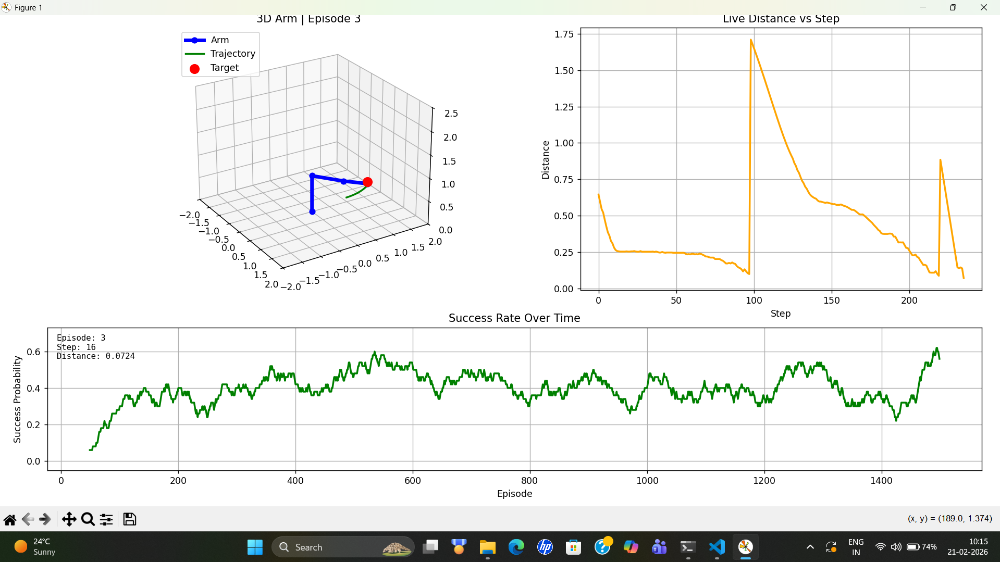
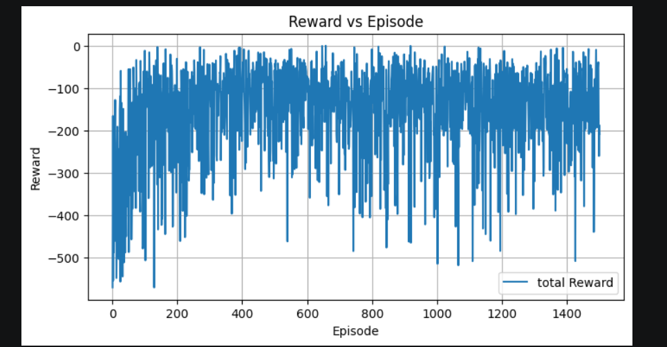

# Robot Arm Movement Optimization using Q-Learning

## Overview
This project focuses on optimizing robotic arm movements using Reinforcement Learning (Q-Learning). The system trains an intelligent agent to learn efficient movement paths and improve positioning accuracy through reward-based learning.

The project simulates robotic arm control where the agent learns optimal actions to minimize movement cost, reduce execution time, and improve overall efficiency.

---

## Problem Statement
Traditional robotic arm movement systems often rely on predefined movement sequences that may not be optimal in dynamic environments.

This project aims to use Reinforcement Learning to:
- Optimize robotic arm trajectories
- Reduce unnecessary movements
- Improve positioning accuracy
- Minimize execution time

---

# 🚀 Features
- Q-Learning based optimization
- Reward-driven learning mechanism
- Robotic arm movement simulation
- Trajectory optimization
- State-action learning
- Performance evaluation and convergence analysis
- Experimental reinforcement learning pipeline

---

## Technologies Used
- Python
- NumPy
- Matplotlib
- Reinforcement Learning
- Q-Learning
- Jupyter Notebook

---

## Reinforcement Learning Approach

### State
Represents the current position/state of the robotic arm.

### Actions
Possible movements the robotic arm can take.

### Reward Function
The agent receives rewards based on:
- Efficient movement
- Reduced movement cost
- Faster task completion
- Accurate positioning

### Goal
Train the agent to learn the optimal sequence of actions for efficient robotic arm movement.

---

## Results
- Improved movement efficiency through Q-Learning
- Reduced unnecessary robotic arm movements
- Achieved optimized trajectory planning
- Demonstrated convergence behavior during training

---

## Screenshots

### Training Visualization


### Robot Arm Simulation


### Reward Curve


---

## Future Improvements
- Deep Q-Learning implementation
- Real-time robotic arm integration
- Multi-agent reinforcement learning
- Advanced motion planning
- 3D robotic simulation environment

---

## Installation

```bash
git clone https://github.com/your-username/robot-arm-qlearning-optimization.git
cd robot-arm-qlearning-optimization

pip install -r requirements.txt
```

---

## Run the Project

```bash
python app.py
```

## Demo  link:
https://youtu.be/BA9MR5Sq6wk
---

## Author
Surya Yedugani

AI & Machine Learning Engineer
